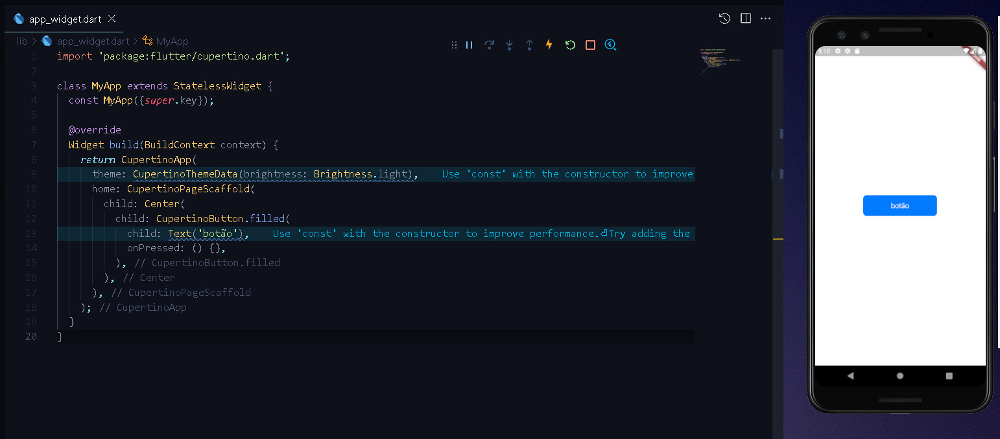

 # school APP

App Flutter criado no Bootcamp [MJV SCHOOL](https://academy.mjvinnovation.com/br/mjvschool/) sobre este framework de desenvolvimento de aplicativos móveis.

### O que está incluído
---

 + Utilização da Biblioteca CUPERTINO

### Como usar
---
Baixe ou clone este repositório usando o link abaixo:


```
    https://github.com/pablopgalvao/mjv_school_flutter.git
```

Vá para a raiz do projeto e execute o seguinte comando no console para obter as dependências necessárias:
```
    flutter pub get 
```

### Desenvolvimento produtivo
---

Flutter oferece hot reload com estado, permitindo que você faça alterações em seu código e veja os resultados instantaneamente sem reiniciar seu aplicativo ou perder seu estado.

 + App usando o CUPERTINO



 + Tela inicial TODO LIST


###### Direitos autorais e licença
---
Código e documentação `copyright 2023` dos autores. Código liberado sob a licença MIT.